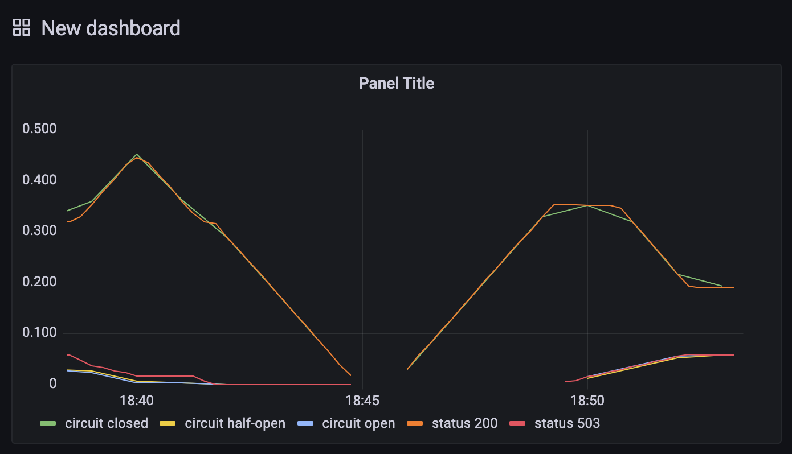

# circuit-breaker-example

Shows how to leverage circuit breaking in go, using [gobreaker](https://github.com/sony/gobreaker).

Inspired by [Secure integrations with Circuit Breaker in Go](https://dev.to/he110/circuitbreaker-pattern-in-go-43cn).

# implementation

A `client` makes requests to `server`'s `/trip` endpoint. `/trip` returns `200`
by default. 

`server`'s status codes can be toggled to `5xx` and back to `200` by
hitting `/circuit/open` and `/circuit/close`.

TL;DR when the circuit is closed it means we'll let requests go to the origin; 
when it's open we'll return the latest response without hitting the origin. 
We'll set the circuit to half-open to let few requests in to check the status of the origin.

# run

Just run `docker-compose up`. You can then:

- hit the open endpoint with `curl http://localhost:8080/circuit/open`
- hit the close endpoint with `curl http://localhost:8080/circuit/close`
- check metrics on `prometheus` at `localhost:9090`
- check metrics on `grafana` at `localhost:3030`

# metrics

Circuit statuses vs response codes:

